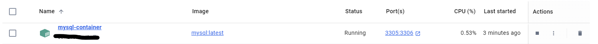

## 도커 기본 용어
## 컨테이너

Docker 컨테이너는 하나의 독립적인 어플리케이션과 그 실행 환경을 포함하는 단위

### 이미지

도커 이미지는 컨테이너를 생성하는 데 사용되는 템플릿 또는 블루프린트입니다. 이미지는 어플리케이션과 모든 종속성, 라이브러리, 기타 필요한 파일 시스템과 설정을 포함하고 있어, 이를 바탕으로 실행할 수 있는 독립적인 컨테이너를 생성할 수 있습니다.

이미지는 여러 계층(layer)으로 구성되어 있으며, 각 계층은 변경사항을 저장합니다. 이 계층적 구조는 효율적인 저장소 사용을 가능하게 하며, 이미지를 재사용하고 공유하기 쉽게 만들어 줍니다. 예를 들어, 여러 이미지가 같은 베이스 이미지(예: 우분투, 알파인)를 사용할 경우, 이 베이스 이미지의 계층은 한 번만 저장되고 여러 이미지에 의해 공유될 수 있습니다.

### **요약**

- **이미지**: 컨테이너를 생성하기 위한 불변의 템플릿입니다. 어플리케이션을 실행하는 데 필요한 모든 파일과 설정을 포함합니다.
- **컨테이너**: 이미지를 기반으로 생성된 실행 가능한 인스턴스입니다. 실행 중에 발생하는 모든 변경사항을 포함할 수 있는 독립적인 환경을 제공합니다.


### 프로그래밍적 관점에서의 도커

**도커 이미지(Docker Image)** 는 **클래스(Class)** 와 비슷합니다. 클래스는 특정 객체를 생성하기 위한 템플릿 또는 설계도 역할을 합니다. 클래스는 객체의 구조와 행동을 정의하며, 실제로 인스턴스화 되기 전까지는 메모리 상에 활성화되지 않습니다.

마찬가지로, **도커 이미지**는 컨테이너를 생성하기 위한 템플릿으로, 필요한 모든 파일, 라이브러리, 종속성 및 실행 명령을 포함하고 있습니다. 이미지 자체는 변경이 불가능하며(immutable), 이를 기반으로 하나 이상의 컨테이너를 실행할 수 있습니다.

**도커 컨테이너(Docker Container)** 는 **객체(Object)** 와 비슷합니다. 객체는 클래스에 의해 정의된 속성과 메서드를 실제로 메모리 상에 구현한 인스턴스입니다. 객체는 클래스로부터 생성되어 독립적으로 작동할 수 있는 실체입니다.

비슷하게, **도커 컨테이너**는 이미지를 기반으로 생성된 런타임 인스턴스입니다. 컨테이너는 이미지에서 정의된 내용을 실행하는 활성화된 상태이며, 컨테이너 내부에서 이루어지는 모든 변경은 컨테이너에만 국한되어, 다른 컨테이너에는 영향을 미치지 않습니다.  
  

## 도커 이미지 설정
- 설치
    - https://docs.docker.com/desktop/install/windows-install/

docker 설치가 완료 되었다면 docker 버전을 터머닐에서 확인
```sh
docker -v
```
  
  
## Mysql 이미지 설치
도커 데스크톱에서 다운받을 이미지를 검색:  
  
터미널에서 해당 명령어 실행:
```sh
docker pull mysql
```
  
다운받은 이미지 확인  
```sh
docker images
```
  
  
다운 받은 이미지는 도커 데스크톱에서도 확인 가능하다.  
  
  
다운 받은 이미지의 컨테이너를 생성 및 실행:  
```sh
docker run --name mysql-container -e MYSQL_ROOT_PASSWORD=<password> -d -p 3306:3306 mysql:latest
```  
*  --name <container_name> : <container_name> 이름의 컨테이너를 실행한다.
*  -e : 컨테이너 내에서 사용할 환경변수를 설정
*  -e MYSQL_ROOT_PASSWORD=<password> : MySQL의 root 권한의 비밀번호를 <password>로 설정한다.
*  -d : detach 모드로 컨테이너가 실행된다. 컨테이너가 백그라운드로 실행된다고 보면 된다.
*  -p <호스트 포트> <컨테이너 포트> : 호스트와 컨테이너의 포트를 연결한다
*  mysql:latest : 컨테이너에 사용할 이미지

Docker Volume 사용 예시:
```sh
docker run --name mysql-container -e MYSQL_ROOT_PASSWORD=<password> -d -v mysql-data:/var/lib/mysql mysql:latest
```
* -v mysql-data:/var/lib/mysql:
  - mysql-data: 호스트 시스템에서 볼륨의 이름입니다. Docker가 자동으로 볼륨을 생성합니다.
  -   /var/lib/mysql: MySQL 컨테이너 내부에서 데이터가 저장되는 디렉토리입니다. 이 디렉토리가 호스트의 mysql-data 볼륨과 연결됩니다.  

Docker Volume의 주요 개념:
- 데이터 영속성: 컨테이너가 삭제되거나 다시 시작되더라도 데이터가 유지됩니다.
- 데이터 공유: 여러 컨테이너 간에 데이터를 공유할 수 있습니다.
- 보안: 데이터 접근 권한을 제어할 수 있습니다.  


    
  
명령어를 실행후 컨테이너가 생성되었나면 해당 명령어를 통해 컨테이너 목록을 조회할 수 있다:
```sh
docker ps -a
```  
  
  
  
생성된 컨테이너의 bash 접속:  
```sh
exec -it mysql-container bash
```
  
테스크톱 화면에서도 접속할 수 있다.  
  
  
## Docker에 띄어진 Mysql 연결하기
  

  

  
  
